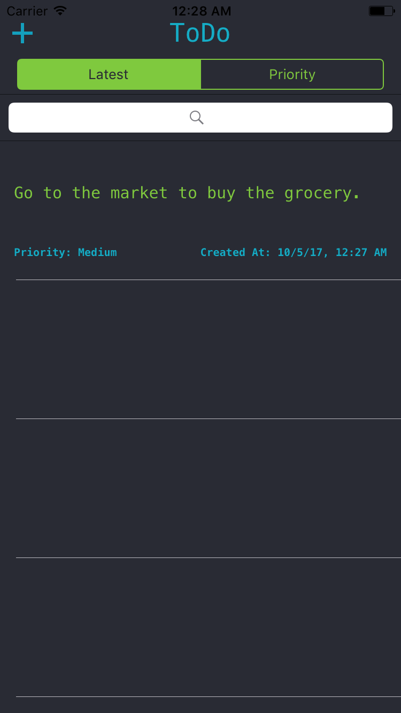

# Todo App

This repo perform crud operation with `Realm Database` integration.

## Usage

You can prioritize your tasks and sort them on the basis of priority or latest one.

## Versions

#### Version 1.0
- Intital version with Swift 3.0

#### Version 2.0
- Compatible with Xcode 11.2.1
- Update to Swift 5.0
- Add Swift Lint
- Code Improvements

## Reached Me	

I can be reached at `waqar.zahour@gmail.com`
